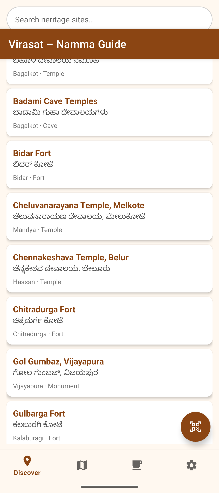
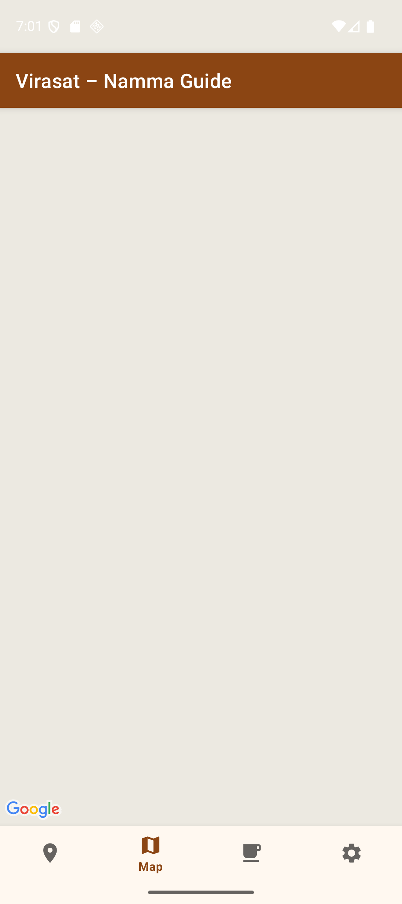
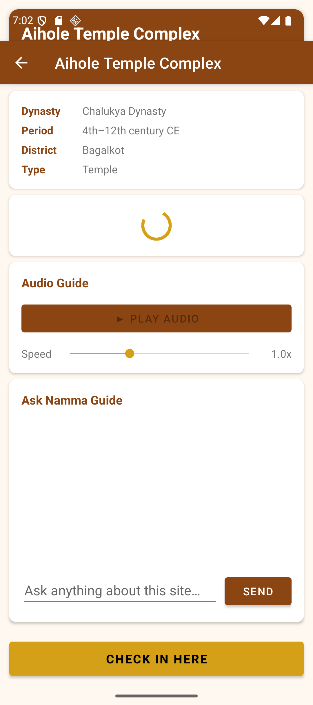
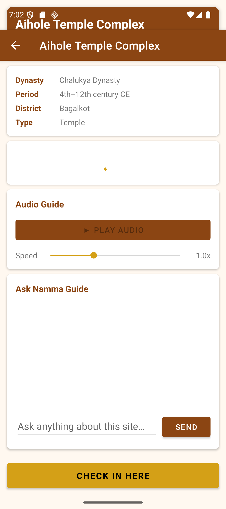
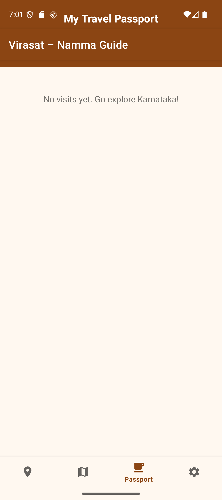

# NammaGuide — Karnataka Heritage Explorer

> An AI-powered Android app that transforms how you discover, explore, and learn about Karnataka's ancient heritage sites.

NammaGuide puts a knowledgeable AI guide, interactive maps, QR check-ins, and a digital passport system in every traveller's pocket — making heritage tourism personal, immersive, and gamified.

---

## Problem Statement

Karnataka is home to some of India's most extraordinary heritage — from the Vijayanagara ruins at Hampi to the Hoysala temples of Belur and Halebidu. Yet most visitors lack access to a personalised, interactive guide that can answer their specific questions in their own language, track their visits, and reward exploration.

**NammaGuide** bridges this gap by combining AI, GPS, and gamification into a single offline-friendly Android application.

---

## Features

| Feature | Description |
|---------|-------------|
| AI Heritage Guide | Ask any question about a site in English or Kannada; answers powered by Google Gemini with intelligent response caching |
| Smart Site Discovery | Sites sorted by distance from your GPS location with real-time search |
| Interactive Map | Google Maps with colour-coded markers — green = visited, red = unvisited |
| QR Code Check-in | Scan site QR codes for instant check-in |
| GPS Check-in | Validates physical presence within 200 m radius |
| Audio Guide | Heritage commentary with adjustable playback speed (0.75× – 2×) |
| Digital Passport | Collect stamps for every site you visit; track your progress |
| Multilingual | Full English and Kannada language support |
| Offline-first | Room database caches site data and AI responses locally |
| Background Sync | WorkManager refreshes content every 24 hours automatically |

---

## Screenshots

| Home — Site List | Map View | Site Detail |
|:---:|:---:|:---:|
|  |  |  |

| AI Chat | Digital Passport | QR Scanner |
|:---:|:---:|:---:|
|  |  |  |

---

## Tech Stack

| Category | Technology |
|----------|------------|
| Language | Kotlin |
| Architecture | MVVM + Repository Pattern |
| UI | Jetpack Navigation, ViewBinding, RecyclerView |
| Database | Room (SQLite ORM) |
| Networking | Retrofit 2 + OkHttp 4 |
| AI / ML | Google Gemini API, ML Kit Barcode Scanning |
| Maps | Google Maps SDK 18, Fused Location Provider 21 |
| Camera | CameraX 1.3 |
| Background Tasks | WorkManager 2.9 |
| Async | Kotlin Coroutines + StateFlow |
| Image Loading | Glide 4.16 |
| Build | Gradle KTS + KSP |
| Min SDK | API 26 (Android 8.0) |
| Target SDK | API 35 (Android 15) |

---

## Prerequisites

- **Android Studio** Hedgehog 2023.1.1 or newer
- **Android SDK** API 26+
- **Google Gemini API key** — [get one at Google AI Studio](https://aistudio.google.com/app/apikey)
- **Google Maps API key** — [get one at Google Cloud Console](https://console.cloud.google.com/)

---

## Installation & Setup

### 1. Clone the Repository

```bash
git clone https://github.com/your-username/nammaVi.git
cd nammaVi
```

### 2. Configure API Keys

Copy the example properties file and fill in your keys:

```bash
cp local.properties.example local.properties
```

Edit `local.properties`:

```properties
sdk.dir=/path/to/your/Android/Sdk
GEMINI_API_KEY=your_gemini_api_key_here
MAPS_API_KEY=your_google_maps_api_key_here
```

> **Note:** `local.properties` is excluded from version control via `.gitignore` to keep API keys private.

### 3. Build the Project

**Using Android Studio:**

1. Open the project folder in Android Studio
2. Wait for Gradle sync to complete (first run downloads dependencies)
3. Connect a device or start an emulator (API 26+)
4. Click **Run ▶** or press `Shift + F10`

**Using Gradle CLI:**

```bash
# Build debug APK
./gradlew assembleDebug

# Install directly on connected device
./gradlew installDebug

# Run unit tests
./gradlew test

# Full build check
./gradlew build
```

The debug APK is generated at:
```
app/build/outputs/apk/debug/app-debug.apk
```

---

## Project Structure

```
nammaVi/
├── app/
│   ├── src/main/
│   │   ├── java/com/virasat/nammaguide/
│   │   │   ├── data/
│   │   │   │   ├── api/              # Retrofit service — Gemini API
│   │   │   │   ├── db/
│   │   │   │   │   ├── dao/          # Room DAOs (HeritageSite, CheckIn, AICache)
│   │   │   │   │   └── entity/       # Room entities
│   │   │   │   ├── model/            # API request/response models
│   │   │   │   └── repository/       # SiteRepository, PassportRepository, SeedData
│   │   │   ├── service/              # AudioPlaybackService (foreground)
│   │   │   ├── ui/
│   │   │   │   ├── detail/           # SiteDetailActivity + Gemini AI chat
│   │   │   │   ├── home/             # Site list with live search
│   │   │   │   ├── map/              # Google Maps fragment
│   │   │   │   ├── passport/         # Stamp collection view
│   │   │   │   ├── scanner/          # CameraX + ML Kit QR scanner
│   │   │   │   └── settings/         # Language & preferences
│   │   │   ├── worker/               # SyncWorker (WorkManager)
│   │   │   ├── MainActivity.kt       # NavHost + bottom navigation
│   │   │   └── VGuideApplication.kt  # App-level DI and initialisation
│   │   └── res/
│   │       ├── layout/               # XML layouts (activities + fragments)
│   │       ├── navigation/           # Navigation graph
│   │       ├── menu/                 # Bottom nav menu
│   │       ├── drawable/             # Vector icons
│   │       └── values/               # strings.xml, colors.xml, themes.xml
│   └── build.gradle.kts
├── gradle/wrapper/
│   ├── gradle-wrapper.jar
│   └── gradle-wrapper.properties
├── screenshots/                      # App screenshots for documentation
├── build.gradle.kts
├── settings.gradle.kts
├── gradle.properties
├── local.properties.example          # API key template (copy → local.properties)
└── .gitignore
```

---

## Architecture

NammaGuide follows the **MVVM (Model-View-ViewModel)** architecture pattern recommended by Google for Android development.

```
┌────────────────────────────────────────┐
│              UI Layer                  │
│  Fragments · Activities · Adapters     │
└──────────────────┬─────────────────────┘
                   │  observes StateFlow
┌──────────────────▼─────────────────────┐
│           ViewModel Layer              │
│  HomeViewModel · MapViewModel          │
│  PassportViewModel · SiteDetailVM      │
└──────────────────┬─────────────────────┘
                   │  calls suspend fns
┌──────────────────▼─────────────────────┐
│          Repository Layer              │
│  SiteRepository · PassportRepository  │
└────────────┬───────────────┬───────────┘
             │               │
┌────────────▼──────┐ ┌──────▼────────────┐
│   Room Database   │ │   Gemini REST API │
│  (Local Caching)  │ │   (AI Q&A Guide)  │
└───────────────────┘ └───────────────────┘
```

---

## Heritage Sites

NammaGuide features **20 significant Karnataka heritage sites** spanning multiple dynasties:

| Site | District | Dynasty / Period |
|------|----------|-----------------|
| Virupaksha Temple, Hampi | Ballari | Vijayanagara (14th–16th c.) |
| Bidar Fort | Bidar | Bahmani Sultanate (15th c.) |
| Gol Gumbaz | Vijayapura | Adil Shahi (17th c.) |
| Badami Cave Temples | Bagalkot | Chalukya (6th–8th c.) |
| Aihole Temple Complex | Bagalkot | Early Chalukya (4th–12th c.) |
| Pattadakal Monuments | Bagalkot | Chalukya — UNESCO WHS |
| Chennakeshava Temple, Belur | Hassan | Hoysala (12th c.) |
| Hoysaleswara Temple, Halebidu | Hassan | Hoysala (12th c.) |
| Keshava Temple, Somanathapura | Mysuru | Hoysala (13th c.) |
| Mysore Palace | Mysuru | Wadiyar (19th–20th c.) |
| Shravanabelagola | Hassan | Ganga Dynasty (10th c.) |
| Srirangapatna Fort | Mandya | Hyder Ali / Tipu Sultan |
| Chitradurga Fort | Chitradurga | Nayaka / Hyder Ali |
| Trikuteshwara Temple, Gadag | Gadag | Kalyani Chalukya (12th c.) |
| Lakkundi Temple Complex | Gadag | Kalyani Chalukya (11th–12th c.) |
| Gulbarga Fort | Kalaburagi | Bahmani Sultanate (14th c.) |
| Raichur Fort | Raichur | Bahmani / Vijayanagara |
| Madhukeshwara Temple, Banavasi | Uttara Kannada | Kadamba (4th c.) |
| Cheluvanarayana Temple, Melkote | Mandya | Hoysala / Wadiyar |
| Panchalinga Temples, Talakadu | Mysuru | Ganga / Hoysala |

---

## How QR Check-in Works

Each heritage site has a unique QR code in the format:

```
virasat_{siteId}
```

When scanned with the in-app QR Scanner:
1. ML Kit decodes the QR code
2. The app validates the format and extracts the site ID
3. `SiteDetailActivity` opens with `from_qr = true`
4. A passport stamp is awarded automatically

For GPS check-in, the app validates the user is within **200 metres** of the site coordinates before awarding the stamp.

---

## Configuration

### Language

Switch between English and Kannada in the **Settings** tab. The preference is persisted in SharedPreferences and applied app-wide.

### AI Guide Persona

The Gemini AI guide uses a custom system instruction (`GUIDE_PERSONA`) that makes it respond as a knowledgeable Karnataka heritage expert. Responses are cached in the Room database (`AIQueryCache`) keyed on `siteId + question + language` to avoid redundant API calls.

---

## Future Improvements

- [ ] Augmented Reality (AR) overlays at site locations
- [ ] Social sharing of stamps and travel stories
- [ ] Offline audio file download for no-connectivity use
- [ ] Trip planner with route optimisation between sites
- [ ] Push notifications when near an unvisited heritage site
- [ ] Community corrections and photo contributions
- [ ] Support for heritage sites in other Indian states
- [ ] Accessibility improvements (TalkBack, font scaling)

---

## Contributing

Pull requests are welcome. For major changes, please open an issue first to discuss what you would like to change.

1. Fork the project
2. Create your feature branch (`git checkout -b feature/AmazingFeature`)
3. Commit your changes (`git commit -m 'Add AmazingFeature'`)
4. Push to the branch (`git push origin feature/AmazingFeature`)
5. Open a Pull Request

---

## License

This project is licensed under the MIT License — see the [LICENSE](LICENSE) file for details.

---

## Acknowledgements

- [Google Gemini](https://deepmind.google/technologies/gemini/) for AI-powered heritage Q&A
- [Google Maps Platform](https://mapsplatform.google.com/) for maps and location services
- [ML Kit](https://developers.google.com/ml-kit) for on-device QR code scanning
- Karnataka Department of Archaeology, Museums and Heritage for site data reference
